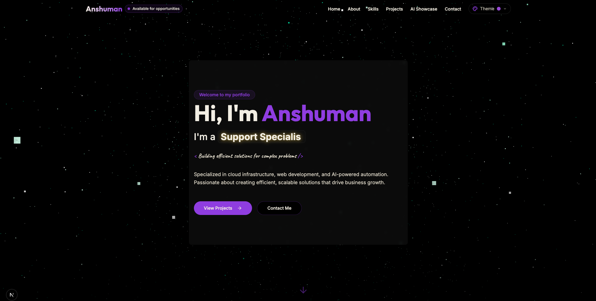

# Anshuman's Portfolio - v2

[](https://opensource.org/licenses/MIT)

 


## Overview

This repository contains the code for my personal portfolio website (v2). It showcases my skills, projects, and experience as a Cloud Engineer, Web Developer, and AI enthusiast. The portfolio is built with modern web technologies, featuring a sleek design, smooth animations, interactive elements, and a dynamic theme switcher.

**Live Demo:** https://anshumandev.cloud/

## Key Features

*   **Responsive Design:** Adapts seamlessly to various screen sizes (desktop, tablet, mobile).
*   **Dynamic Theming:** Multiple themes with a theme switcher.
*   **Interactive Sections:** About (Riddles), Skills (Visualization), Projects (Filterable), AI Showcase, Contact Form.
*   **Smooth Animations:** Built with Framer Motion.
*   **Particle Background:** Animated particle background using Three.js (theme-aware).
*   **Data-Driven Content:** Uses JSON files (`/data`).
*   **Code Splitting:** Sections below the fold are loaded dynamically.

## Tech Stack

*   **Framework:** Next.js (App Router)
*   **Language:** TypeScript
*   **Styling:** Tailwind CSS
*   **Animation:** Framer Motion
*   **3D Graphics:** Three.js
*   **Form Handling:** React Hook Form & Zod
*   **Icons:** Lucide React

## Getting Started

### Prerequisites

*   Node.js (v18+)
*   npm / yarn

### Installation

1.  **Clone the repository:**
    ```bash
    git clone https://github.com/shhumaan/portfolio-dist.git
    cd portfolio-dist
    ```

2.  **Install dependencies:**
    ```bash
    npm install
    # or
    yarn install
    ```

### Running Locally

```bash
npm run dev
# or
yarn dev
```

Open [http://localhost:3000](http://localhost:3000) (or specified port).

### Building for Production

```bash
npm run build
# or
yarn build
```

## Folder Structure

```
portfolio-v2/
├── app/                  # Next.js App Router directory
│   ├── (main)/           # Main application layout and pages
│   │   ├── layout.tsx
│   │   └── page.tsx
│   ├── api/              # API routes (if any)
│   └── globals.css       # Global styles and Tailwind directives
├── components/           # Reusable UI components
│   ├── layout/           # Header, Footer, etc.
│   ├── sections/         # Major page sections (Hero, About, etc.)
│   └── ui/               # Smaller, general-purpose UI elements (Buttons, Cards, etc.)
├── data/                 # JSON files for site content
├── hooks/                # Custom React hooks
├── lib/                  # Utility functions (e.g., cn for Tailwind)
├── public/               # Static assets (images, fonts, etc.)
├── styles/               # Additional global styles (if needed)
├── types/                # TypeScript type definitions
├── .env.local            # Environment variables (if any - DO NOT COMMIT sensitive keys)
├── .eslintrc.json        # ESLint configuration
├── .gitignore            # Files ignored by Git
├── next.config.mjs       # Next.js configuration
├── package.json          # Project dependencies and scripts
├── README.md             # This file
├── tailwind.config.ts    # Tailwind CSS configuration
└── tsconfig.json         # TypeScript configuration
```

## Deployment

Deployed via [Vercel](https://vercel.com/). See instructions below or the official [Next.js Vercel deployment guide](https://nextjs.org/docs/deployment).

## License

MIT License - see [LICENSE](LICENSE) file. **(IMPORTANT: Ensure you have a LICENSE file!)**

## Contact

Anshuman - Reach out via the portfolio's contact form! 